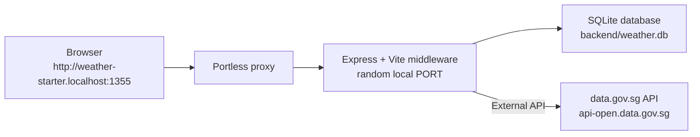

# Weather Starter

A minimal TypeScript weather app starter project for agentic coding.

The app tracks Singapore locations and stores the latest weather snapshot for each one. It uses a Node/Express backend, a React/Vite frontend, and Portless for a stable local `.localhost` URL.

## Tech Stack

| Layer        | Tools                                                                 |
| ------------ | --------------------------------------------------------------------- |
| Backend      | Node.js, TypeScript, Express                                          |
| Frontend     | React 18, Vite, Tailwind CSS                                          |
| Dev URL      | Portless named `.localhost` URLs                                      |
| External API | Singapore data.gov.sg (`api-open.data.gov.sg`)                        |
| Storage      | SQLite database at `backend/weather.db`, accessed through Drizzle ORM |

## Architecture



The backend and frontend run as one Node process in development. Express serves `/api/*`, and Vite middleware serves the React app. The frontend uses relative `/api` requests, so there is no frontend/backend port configuration.

## Quick Start

Install dependencies:

```bash
npm install
```

Start the app:

```bash
npm run dev
```

This project runs Portless on an unprivileged local proxy port by default, so no sudo or certificate trust prompt is required. After startup, open the URL printed by Portless, normally:

```text
http://weather-starter.localhost:1355
```

## Useful Commands

```bash
npm run dev      # Start Express + Vite through Portless
npm run build    # Build the frontend and compile backend TypeScript
npm run start    # Run the compiled production server
npm test         # Run backend API tests
npm run test:watch # Run backend API tests in watch mode
npm run doctor   # Verify /health and /api/locations
npm run reset    # Remove the local SQLite database
npm run db:generate # Generate Drizzle migrations after schema changes
npm run db:migrate  # Apply Drizzle migrations to backend/weather.db
```

## API

| Method | Endpoint                     | Description                    |
| ------ | ---------------------------- | ------------------------------ |
| `GET`  | `/health`                    | Health check                   |
| `GET`  | `/api/locations`             | List all locations             |
| `POST` | `/api/locations`             | Create a location              |
| `GET`  | `/api/locations/:id`         | Get a single location          |
| `POST` | `/api/locations/:id/refresh` | Refresh weather for a location |

Create a location:

```bash
curl -s -X POST http://weather-starter.localhost:1355/api/locations \
  -H "Content-Type: application/json" \
  -d '{"latitude": 1.35, "longitude": 103.85}'
```

Refresh weather:

```bash
curl -s -X POST http://weather-starter.localhost:1355/api/locations/1/refresh
```

## Data Flow

The app does not call the external weather API on every page load. It uses a snapshot pattern:

1. Creating a location saves coordinates locally with a placeholder weather status.
2. The backend immediately refreshes that new location from data.gov.sg, writes the latest snapshot, and returns the updated location.
3. Listing locations reads from `backend/weather.db` through Drizzle ORM.
4. Manual refresh calls data.gov.sg again, writes the latest snapshot back to the local store, and returns the updated location.

## Project Structure

```text
weather-starter/
├── backend/
│   ├── drizzle/                       # Generated Drizzle SQL migrations
│   ├── package.json
│   ├── tsconfig.json
│   └── src/
│       ├── server.ts                  # Express app + Vite middleware
│       ├── db.ts                      # SQLite connection and data access helpers
│       ├── logger.ts                  # Structured app logger
│       ├── schema.ts                  # Drizzle table definitions
│       ├── weather.ts                 # Singapore weather API client
│       └── routes/
│           ├── locations.ts           # Location endpoints
│           └── locations.test.ts      # Location API tests
├── frontend/
│   ├── index.html
│   ├── package.json
│   ├── postcss.config.js
│   ├── tailwind.config.js
│   ├── vite.config.ts
│   └── src/
│       ├── main.tsx
│       ├── App.tsx
│       ├── api.ts
│       ├── state/
│       ├── components/
│       └── index.css
├── scripts/
│   ├── dev.mjs
│   ├── start.mjs
│   ├── doctor.mjs
│   └── reset.mjs
├── package.json
└── package-lock.json
```

## External API Reference

All endpoints are on `https://api-open.data.gov.sg`. No API key is required for basic usage, but you may hit rate limits during heavy development.

| Endpoint                                       | Docs                                                                                        | Notes                                                                                         |
| ---------------------------------------------- | ------------------------------------------------------------------------------------------- | --------------------------------------------------------------------------------------------- |
| `GET /v2/real-time/api/two-hr-forecast`        | [2-hour Forecast](https://data.gov.sg/datasets/d_3f9e064e25005b0e42969944ccaf2e7a/view)     | Used by this app. Response includes `area_metadata` and area forecasts.                       |
| `GET /v2/real-time/api/air-temperature`        | [Realtime Weather Readings](https://data.gov.sg/collections/realtime-weather-readings/view) | Temperature in Celsius from weather stations.                                                 |
| `GET /v2/real-time/api/relative-humidity`      | [Realtime Weather Readings](https://data.gov.sg/collections/realtime-weather-readings/view) | Humidity percentage from weather stations.                                                    |
| `GET /v2/real-time/api/rainfall`               | [Realtime Weather Readings](https://data.gov.sg/collections/realtime-weather-readings/view) | Rainfall in mm from weather stations.                                                         |
| `GET /v2/real-time/api/wind-speed`             | [Realtime Weather Readings](https://data.gov.sg/collections/realtime-weather-readings/view) | Wind speed in knots from weather stations.                                                    |
| `GET /v2/real-time/api/wind-direction`         | [Realtime Weather Readings](https://data.gov.sg/collections/realtime-weather-readings/view) | Wind direction in degrees from weather stations.                                              |
| `GET /v1/environment/24-hour-weather-forecast` | [Weather Forecast](https://data.gov.sg/collections/weather-forecast/view)                   | 24-hour forecast broken into time periods. Different response shape from the 2-hour endpoint. |
| `GET /v1/environment/4-day-weather-forecast`   | [Weather Forecast](https://data.gov.sg/collections/weather-forecast/view)                   | 4-day outlook with temperature ranges and forecast text.                                      |

Optional API key:

```bash
export WEATHER_API_KEY=your_api_key_here
npm run dev
```

## Feature Tasks

These tasks are ordered from easiest to hardest. Each one builds on the existing codebase and introduces new concepts progressively. File names may differ by implementation, but the product behavior should stay the same.

### 1. Delete a location

Add a `DELETE /api/locations/:id` endpoint and a delete button to each card in `SidebarCard.tsx`.

| Layer    | What to do                              |
| -------- | --------------------------------------- |
| Backend  | New DELETE endpoint for saved locations |
| Frontend | Delete button in `SidebarCard.tsx`      |

### 2. Geolocation + auto-detect

Add a "Use my location" button that detects the user's position, finds the nearest Singapore forecast area, and adds it automatically. Works on local development origins; if you need HTTPS, run Portless with `PORTLESS_HTTPS=1`.

| Layer    | What to do                                                                          |
| -------- | ----------------------------------------------------------------------------------- |
| Backend  | No changes needed if nearest-area matching already exists                           |
| Frontend | New button in `AddLocationForm.tsx` using the Geolocation API. Auto-refresh on add. |

### 3. Singapore area picker

Replace the manual lat/lon inputs with a searchable dropdown. The 2-hour forecast response includes `area_metadata` with area names and coordinates.

| Layer        | What to do                                                                                  |
| ------------ | ------------------------------------------------------------------------------------------- |
| Backend      | Expose forecast areas from the weather API if the frontend cannot already access them       |
| Frontend     | Replace lat/lon fields with a searchable select/autocomplete populated from `area_metadata` |
| External API | `GET /v2/real-time/api/two-hr-forecast` -> `area_metadata` array                            |

### 4. Current conditions detail

Show temperature, humidity, and rainfall alongside the forecast condition. These endpoints share the same general station-reading pattern with coordinates.

| Layer        | What to do                                                                                                           |
| ------------ | -------------------------------------------------------------------------------------------------------------------- |
| Backend      | Add weather API service calls and persist the extra current-condition fields                                         |
| Frontend     | Redesign location cards to show current temp prominently, with humidity and rainfall as secondary details            |
| External API | `GET /v2/real-time/api/air-temperature`, `GET /v2/real-time/api/relative-humidity`, `GET /v2/real-time/api/rainfall` |

### 5. Hourly and multi-day forecast

Add a scrollable hourly timeline and a 4-day daily forecast below each location's current conditions. The 24-hour endpoint returns periods by region. The 4-day endpoint returns daily high/low temperature ranges and outlook text. Both are `v1` endpoints with different response shapes from the 2-hour API.

| Layer        | What to do                                                                                                            |
| ------------ | --------------------------------------------------------------------------------------------------------------------- |
| Backend      | Add service methods and endpoint(s), such as `GET /api/locations/:id/forecast`                                        |
| Frontend     | Horizontally scrollable hourly row plus vertical daily list, each showing condition text/icons and temperature ranges |
| External API | `GET /v1/environment/24-hour-weather-forecast`, `GET /v1/environment/4-day-weather-forecast`                          |

### 6. Wind and atmospheric readings

Add a wind and atmosphere section showing wind speed and direction. Display wind as a compass arrow or animated indicator.

| Layer        | What to do                                                                      |
| ------------ | ------------------------------------------------------------------------------- |
| Backend      | Add weather API service methods and either extend refresh or add a new endpoint |
| Frontend     | New `WindCompass` or similar component showing direction and speed visually     |
| External API | `GET /v2/real-time/api/wind-speed`, `GET /v2/real-time/api/wind-direction`      |

### 7. UI overhaul and theming

Redesign the app layout and styling. Use polished weather condition cards, meaningful icons, responsive layout, and smooth interaction states. Aim for a modern weather dashboard that still keeps the app's existing workflows obvious.

Add a map card to the dashboard as part of the themed dashboard experience. Show all saved locations as pins with small weather labels above them. The card can expand into a full-screen map view, but users should continue adding locations through the existing add-location flow rather than creating pins directly from the map.

| Layer        | What to do                                                                                                                                                                      |
| ------------ | ------------------------------------------------------------------------------------------------------------------------------------------------------------------------------- |
| Backend      | No changes needed                                                                                                                                                               |
| Frontend     | Restyle existing components with Tailwind. Add weather icons, condition-based accents, better mobile states, and a map card using Leaflet/React Leaflet or another map library. |
| NPM packages | `leaflet`, `react-leaflet` or equivalent                                                                                                                                        |

### 8. Location detail page with charts

Add a detail view for each location. Show historical readings over time as line charts for temperature, rainfall, and humidity. Requires storing each refresh as a separate reading instead of overwriting the latest snapshot.

| Layer        | What to do                                                                                |
| ------------ | ----------------------------------------------------------------------------------------- |
| Backend      | Add a readings/history model and endpoint for time-series data                            |
| Frontend     | New detail page/route with charts using Recharts, Chart.ts, or a similar charting library |
| NPM packages | `react-router-dom`, `recharts` or equivalent                                              |

### 9. Multi-location management

Support reordering locations, setting a default/primary location, and swiping between locations on mobile. The primary location shows first on launch.

| Layer    | What to do                                                                    |
| -------- | ----------------------------------------------------------------------------- |
| Backend  | Add persisted sort/default metadata and endpoint(s) to update it              |
| Frontend | Drag-and-drop or manual up/down controls. Swipeable location cards on mobile. |
